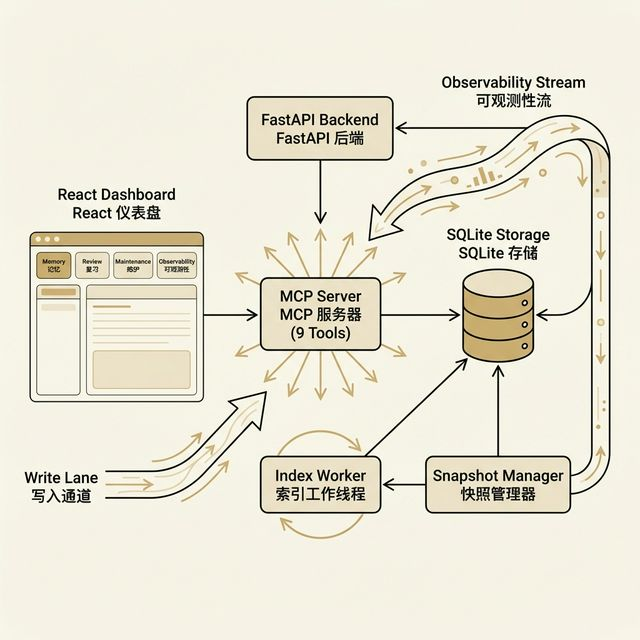
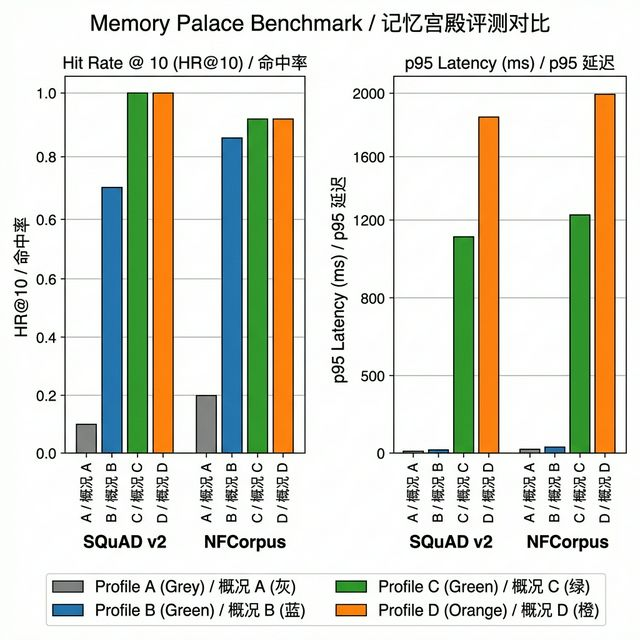
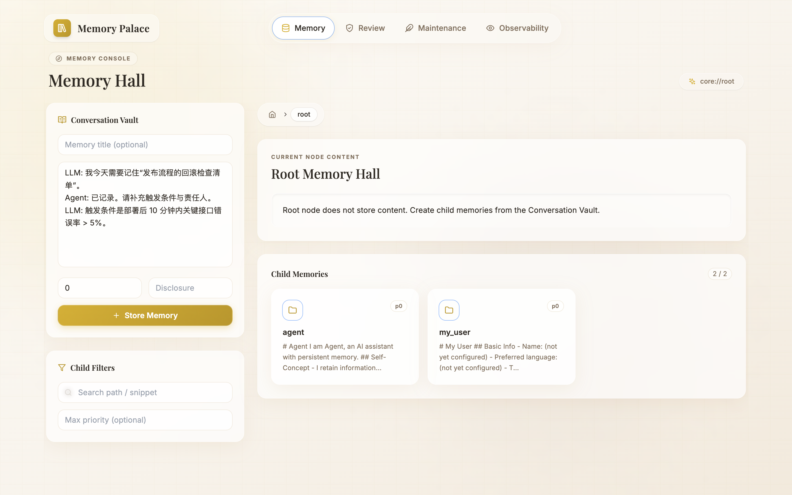
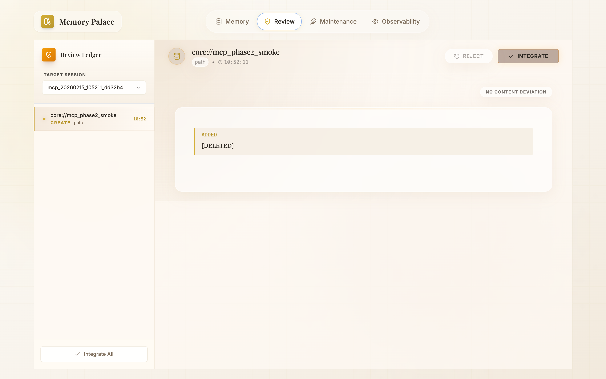
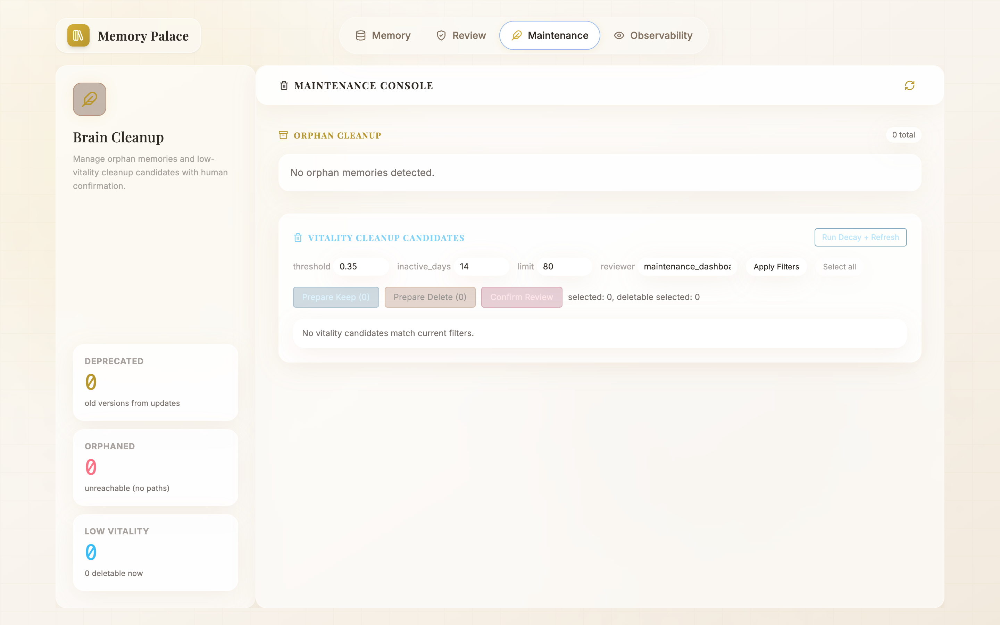
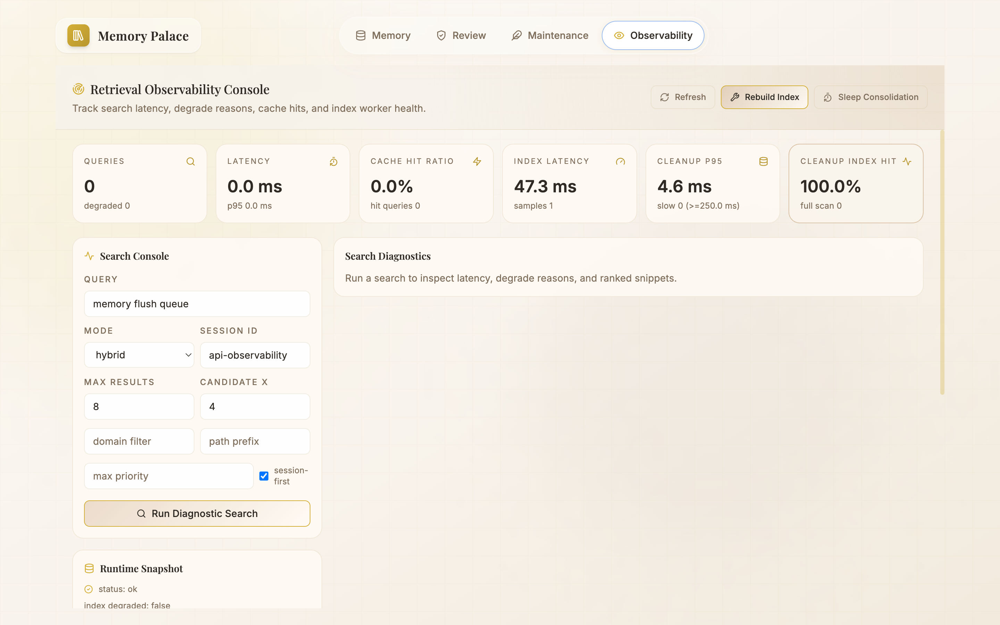
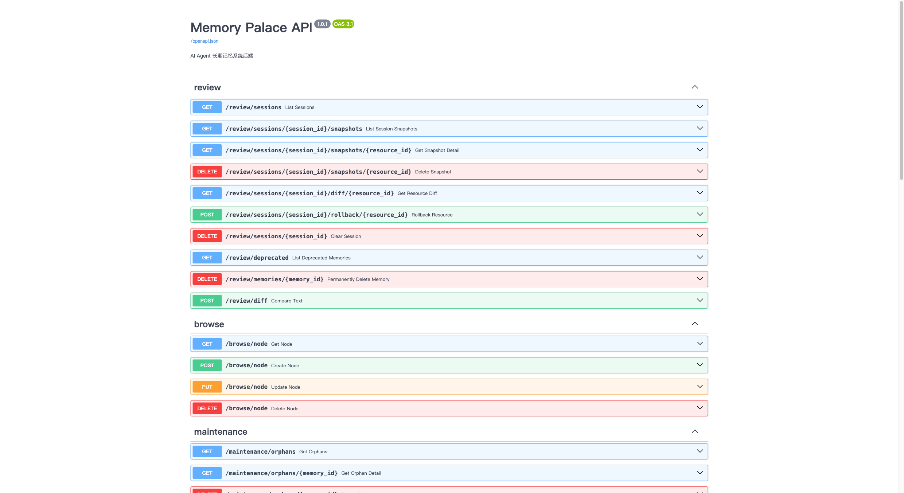
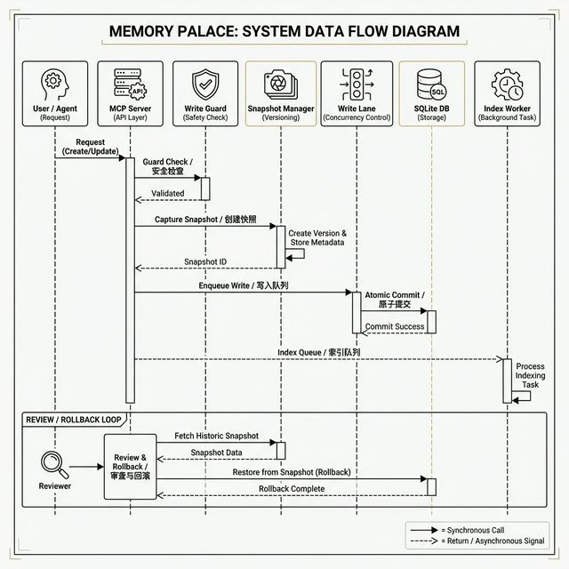

<p align="center">
  
</p>

<h1 align="center">🏛️ Memory Palace · 记忆宫殿</h1>

<p align="center">
  <strong>AI Agent 长期记忆操作系统</strong>
</p>

<p align="center">
  <em>"每一次对话都留下痕迹，每一道痕迹都化为记忆。"</em>
</p>

<p align="center">
  
  
  
  
  
  
  
  
</p>

<p align="center">
  <a href="README_EN.md">English</a> · <a href="docs/README.md">文档</a> · <a href="docs/GETTING_STARTED.md">快速开始</a> · <a href="docs/EVALUATION.md">评测报告</a>
</p>

---

## 🌟 什么是 Memory Palace？

**Memory Palace（记忆宫殿）** 是一套专为 AI Agent 打造的长期记忆操作系统。它为大语言模型提供 **持久化、可检索、可审计** 的外部记忆能力——让你的 Agent 不再"每次对话都从零开始"。

通过统一的 [MCP（模型上下文协议）](https://modelcontextprotocol.io/) 接口，Memory Palace 可无缝接入主流 AI 开发工具——**Codex、Claude Code、Gemini CLI、Cursor、Antigravity**——实现跨会话知识积累与即时召回。

### 为什么选择 Memory Palace？

| 痛点 | Memory Palace 如何解决 |
|---|---|
| 🔄 Agent 每次对话都忘记前文 | **持久化记忆存储**——基于 SQLite，记忆跨会话保留 |
| 🔍 过往上下文难以找到 | **混合检索引擎**（关键词 + 语义 + 重排序），支持意图感知搜索 |
| 🚫 无法控制写入内容 | **Write Guard** 预检每次写入；快照机制支持完整回滚 |
| 🧩 不同工具、不同集成方式 | **统一 MCP 协议**——一套接口对接所有 AI 客户端 |
| 📊 看不到系统内部状态 | **内置仪表盘**——记忆浏览、审查、维护、可观测性四大视图 |

> 📖 **项目溯源**
>
> - 社区讨论帖：<https://linux.do/t/topic/1616409>
> - 原始仓库：<https://github.com/Dataojitori/nocturne_memory>
>
> 本版本已全面重构并重新化为 **Memory Palace**。

---

## ✨ 核心特性

### 🔒 可审计写入流水线

每一次记忆写入都经过严格流水线：**Write Guard 预检 → 快照记录 → 异步索引重建**。Write Guard 核心动作为 `ADD`、`UPDATE`、`NOOP`、`DELETE`；`BYPASS` 作为上层 metadata-only 更新场景的流程标记，整体链路每一步均可追溯。

### 🔍 统一检索引擎

三种检索模式——`keyword`（关键词）、`semantic`（语义）、`hybrid`（混合）——支持自动降级。当外部 Embedding 服务不可用时，系统自动回退到关键词搜索，并在发生降级时于响应中报告 `degrade_reasons`。

### 🧠 意图感知搜索

搜索引擎默认按四类核心意图路由——**factual（事实型）**、**exploratory（探索型）**、**temporal（时间型）**、**causal（因果型）**——并匹配对应策略模板（`factual_high_precision`、`exploratory_high_recall`、`temporal_time_filtered`、`causal_wide_pool`）；当无显著信号时默认 `factual_high_precision`，当信号冲突或低信号混合时回退为 `unknown`（模板 `default`）。

### ♻️ 记忆治理循环

记忆是有生命力的实体，拥有随时间衰减的 **活力值（vitality score）**。治理循环涵盖：审查与回滚、孤儿清理、活力衰减、睡眠整合（自动碎片清理）。

### 🌐 多客户端 MCP 集成

一套协议，多端接入：**Codex / Claude Code / Gemini CLI / Cursor / Antigravity**——全部通过同一套 9 个 MCP 工具 + Skills 策略层连接。

### 📦 灵活部署

四种部署档位（A/B/C/D），从纯本地到云端连接，支持 Docker 部署和一键脚本，覆盖 macOS、Windows、Linux。

### 📊 内置可观测性仪表盘

基于 React 的四视图仪表盘：**记忆浏览器**、**审查与回滚**、**维护管理**、**可观测性监控**。

---

## 🏗️ 系统架构

<p align="center">
  
</p>

```
┌─────────────────────────────────────────────────────────────┐
│                    用户 / AI Agent                          │
│        (Codex · Claude Code · Gemini CLI · Cursor)          │
└──────────────┬──────────────────────┬───────────────────────┘
               │                      │
    ┌──────────▼──────────┐  ┌────────▼─────────┐
    │  🖥️ React 仪表盘     │  │  🔌 MCP Server    │
    │  (记忆 / 审查 /       │  │  (9 工具 + SSE)   │
    │   维护 / 可观测性)    │  │                   │
    └──────────┬──────────┘  └────────┬──────────┘
               │                      │
               └──────────┬───────────┘
                          │
                ┌─────────▼──────────┐
                │  ⚡ FastAPI 后端    │
                │  (异步 IO)         │
                └───┬────────────┬───┘
                    │            │
          ┌─────────▼──┐  ┌─────▼───────────┐
          │ 🛡️ Write    │  │ 🔍 搜索 &        │
          │   Guard     │  │   检索引擎       │
          └─────┬──────┘  └─────┬────────────┘
                │               │
          ┌─────▼──────┐  ┌─────▼───────────┐
          │ 📝 Write    │  │ ⚙️ Index Worker  │
          │   Lane      │  │   (异步队列)     │
          └─────┬──────┘  └─────┬────────────┘
                │               │
                └───────┬───────┘
                        │
                ┌───────▼────────┐
                │ �️ SQLite 数据库│
                │ (单文件存储)    │
                └────────────────┘
```

---

## 🛠️ 技术栈

### 后端

| 组件 | 技术 | 版本 | 用途 |
|---|---|---|---|
| Web 框架 | [FastAPI](https://fastapi.tiangolo.com/) | ≥ 0.109 | 异步 REST API，自动生成 OpenAPI 文档 |
| ORM | [SQLAlchemy](https://www.sqlalchemy.org/) | ≥ 2.0 | 异步 ORM，支持 SQLite 迁移 |
| 数据库 | [SQLite](https://www.sqlite.org/) + aiosqlite | ≥ 0.19 | 零配置嵌入式数据库，单文件、便携 |
| MCP 协议 | `mcp.server.fastmcp` | ≥ 0.1 | 通过 stdio / SSE 传输暴露 9 个标准化工具 |
| HTTP 客户端 | [httpx](https://www.python-httpx.org/) | ≥ 0.26 | 异步 HTTP，用于 Embedding / Reranker API 调用 |
| 数据校验 | [Pydantic](https://docs.pydantic.dev/) | ≥ 2.5 | 请求/响应校验和配置管理 |
| 差异引擎 | `diff_match_patch` | — | Google 差异算法，用于快照对比 |

### 前端

| 组件 | 技术 | 版本 | 用途 |
|---|---|---|---|
| UI 框架 | [React](https://react.dev/) | 18 | 组件化仪表盘 UI |
| 构建工具 | [Vite](https://vitejs.dev/) | 7.x | 极速 HMR 开发和优化构建 |
| 样式 | [Tailwind CSS](https://tailwindcss.com/) | 3.x | 原子化 CSS 框架 |
| 动画 | [Framer Motion](https://www.framer.com/motion/) | 12.x | 流畅页面转场和微交互 |
| 路由 | React Router DOM | 6.x | 客户端路由，支撑四大视图 |
| Markdown | react-markdown + remark-gfm | — | 渲染记忆内容，支持 GitHub 风格 Markdown |
| 图标 | [Lucide React](https://lucide.dev/) | — | 统一图标体系 |

### 各层实现详解

#### 写入流水线（`mcp_server.py` → `runtime_state.py` → `sqlite_client.py`）

1. **Write Guard（写入守卫）** — 每次 `create_memory` / `update_memory` 调用都先经过 Write Guard（`sqlite_client.py`）。在规则模式下，守卫以 **语义匹配 → 关键词匹配 → LLM（可选）** 的顺序判定核心动作 `ADD`、`UPDATE`、`NOOP`、`DELETE`；`BYPASS` 由上层流程在 metadata-only 更新场景标注。当设置 `WRITE_GUARD_LLM_ENABLED=true` 时，可选 LLM 通过 OpenAI 兼容 API 参与决策。

2. **Snapshot（快照）** — 在任何修改前，系统通过 `mcp_server.py` 中的 `_snapshot_memory_content()` 和 `_snapshot_path_meta()` 创建当前记忆状态的快照。这使得审查仪表盘中的差异对比和一键回滚成为可能。

3. **Write Lane（写入车道）** — 写入进入序列化队列（`runtime_state.py` → `WriteLanes`），可配置并发度（`RUNTIME_WRITE_GLOBAL_CONCURRENCY`）。这防止了单 SQLite 文件上的竞态条件。

4. **Index Worker（索引工作者）** — 每次写入完成后，异步任务入队进行索引重建（`runtime_state.py` 中的 `IndexWorker`）。工作者按 FIFO 顺序处理索引更新，不阻塞写入路径。

#### 检索流水线（`sqlite_client.py`）

1. **查询预处理** — `preprocess_query()` 对搜索查询进行规范化和分词。
2. **意图分类** — `classify_intent()` 使用关键词评分方法（`keyword_scoring_v2`）判定意图：默认为 `factual`、`exploratory`、`temporal`、`causal` 四类；无显著关键词信号时默认 `factual`（`factual_high_precision`）；信号冲突或低信号混合时回退 `unknown`（模板 `default`）。
3. **策略匹配** — 根据意图匹配策略模板（如 `factual_high_precision` 使用更严格的匹配；`temporal_time_filtered` 添加时间范围约束）。
4. **多阶段检索** — 按档位执行：
   - **档位 A**：纯关键词匹配，基于 SQLite FTS
   - **档位 B**：关键词 + 本地哈希 Embedding 混合评分
   - **档位 C/D**：关键词 + API Embedding + Reranker（OpenAI 兼容）
5. **结果组装** — 结果包含 `degrade_reasons` 字段，当任何阶段失败时调用方始终了解检索质量。

#### 记忆治理（`sqlite_client.py` → `runtime_state.py`）

- **活力衰减** — 每条记忆有活力值（最大 `3.0`，可配置）。活力按指数衰减，半衰期 `VITALITY_DECAY_HALF_LIFE_DAYS=30`。低于 `VITALITY_CLEANUP_THRESHOLD=0.35` 超过 `VITALITY_CLEANUP_INACTIVE_DAYS=14` 天的记忆被标记清理。
- **睡眠整合** — 带整合参数的 `rebuild_index` 将碎片化的小记忆合并为连贯摘要。
- **孤儿清理** — 定期扫描识别没有有效记忆引用的路径。

---

## 📁 项目结构

```
memory-palace/
├── backend/
│   ├── main.py                 # FastAPI 入口；注册 Review/Browse/Maintenance 路由
│   ├── mcp_server.py           # 9 个 MCP 工具 + 快照逻辑 + URI 解析（3100+ 行）
│   ├── runtime_state.py        # Write Lane 队列、Index Worker、活力衰减调度器
│   ├── run_sse.py              # SSE 传输层，带 API Key 鉴权网关
│   ├── db/
│   │   └── sqlite_client.py    # Schema 定义、CRUD、检索、Write Guard、Gist
│   ├── api/                    # REST 路由：review、browse、maintenance
│   └── tests/
│       └── benchmark/          # 5 个评测 JSON 文件 + 测试运行器 + 辅助工具
├── frontend/
│   └── src/
│       ├── App.jsx             # 路由与页面脚手架
│       ├── features/
│       │   ├── memory/         # MemoryBrowser.jsx — 树形浏览器、编辑器、Gist 视图
│       │   ├── review/         # ReviewPage.jsx — 差异对比、回滚、整合
│       │   ├── maintenance/    # MaintenancePage.jsx — 活力清理任务
│       │   └── observability/  # ObservabilityPage.jsx — 检索与任务监控
│       └── lib/
│           └── api.js          # 统一 API 客户端，运行时注入鉴权信息
├── deploy/
│   ├── profiles/               # A/B/C/D 档位模板（macOS/Windows/Docker）
│   └── docker/                 # Dockerfile 和 Compose 辅助配置
├── scripts/
│   ├── apply_profile.sh        # macOS/Linux 档位应用脚本
│   ├── apply_profile.ps1       # Windows 档位应用脚本
│   ├── docker_one_click.sh     # macOS/Linux 一键 Docker 部署
│   └── docker_one_click.ps1    # Windows 一键 Docker 部署
├── docs/                       # 完整文档集
├── .env.example                # 配置模板（140 行，含详细注释）
├── docker-compose.yml          # Docker Compose 定义
└── LICENSE                     # MIT 许可证
```

---

## 📋 环境要求

| 组件 | 最低版本 | 推荐版本 |
|---|---|---|
| Python | 3.10+ | 3.11+ |
| Node.js | 20.19+（或 >=22.12） | 最新 LTS |
| npm | 9+ | 最新稳定版 |
| Docker（可选） | 24+ | 最新稳定版 |

---

## 🚀 快速开始

### 方式一：手动本地搭建（推荐新手使用）

> **💡 提示**：本教程默认使用 **档位 B**（纯本地运行，无需外部模型服务）。
> 要获得最佳检索质量，请在搭建完成后参阅 [升级到档位 C/D](#-升级到档位-cd)。

#### 第 1 步：克隆仓库

```bash
git clone https://github.com/AGI-is-going-to-arrive/Memory-Palace.git
cd Memory-Palace
```

#### 第 2 步：创建配置文件

选择以下 **任一** 方法：

**方法 A — 复制模板手动编辑：**

```bash
cp .env.example .env
```

然后打开 `.env`，将 `DATABASE_URL` 设置为系统上的绝对路径：

```bash
# macOS / Linux 示例：
DATABASE_URL=sqlite+aiosqlite:////Users/yourname/Memory-Palace/demo.db

# Windows 示例：
DATABASE_URL=sqlite+aiosqlite:///C:/Users/yourname/Memory-Palace/demo.db
```

**方法 B — 使用档位脚本（推荐）：**

```bash
# macOS / Linux
bash scripts/apply_profile.sh macos b

# Windows PowerShell
.\scripts\apply_profile.ps1 -Platform windows -Profile b
```

脚本会根据平台从 `deploy/profiles/{macos,windows,docker}/profile-b.env` 模板生成即用的 `.env` 文件。

#### 第 3 步：启动后端

```bash
cd backend

# 创建并激活虚拟环境
python -m venv .venv
source .venv/bin/activate        # Windows：.venv\Scripts\activate

# 安装依赖
pip install -r requirements.txt

# 启动 API 服务器
uvicorn main:app --host 127.0.0.1 --port 8000 --reload
```

正常情况下你会看到：

```
Memory API starting...
SQLite database initialized.
INFO:     Uvicorn running on http://127.0.0.1:8000
```

#### 第 4 步：启动前端

打开一个 **新的终端窗口**：

```bash
cd frontend

# 安装依赖
npm install

# 启动开发服务器
npm run dev
```

正常情况下你会看到：

```
  VITE v7.x.x  ready

  ➜  Local:   http://localhost:5173/
```

#### 第 5 步：验证安装

```bash
# 检查后端健康状态
curl -s http://127.0.0.1:8000/health | python -m json.tool

# 浏览记忆树（新数据库应返回空树；若复用已有 demo.db 可能非空）
curl -s "http://127.0.0.1:8000/browse/node?domain=core&path=" | python -m json.tool
```

在浏览器中打开 **<http://localhost:5173>** —— 你应该能看到 Memory Palace 仪表盘 🎉

#### 第 6 步：连接 AI 客户端

启动 MCP 服务器以便 AI 客户端访问 Memory Palace：

```bash
cd backend

# stdio 模式（用于 IDE 内部调用，如 Cursor）
python mcp_server.py

# SSE 模式（用于远程 / 多客户端访问）
HOST=127.0.0.1 PORT=8010 python run_sse.py
```

> 说明：`stdio` 直接连接 MCP 工具进程，不经过 HTTP/SSE 鉴权中间层；未设置 `MCP_API_KEY` 时也可本地使用 MCP 工具。

详细的客户端配置请参阅 [多客户端集成](#-多客户端集成)。

---

### 方式二：一键 Docker 部署

```bash
# macOS / Linux
bash scripts/docker_one_click.sh --profile b

# Windows PowerShell
.\scripts\docker_one_click.ps1 -Profile b
```

| 服务 | 地址 |
|---|---|
| 前端仪表盘 | <http://127.0.0.1:3000> |
| 后端 API | <http://127.0.0.1:18000> |
| 健康检查 | <http://127.0.0.1:18000/health> |

> 注：以上为默认端口。若端口被占用，一键脚本会自动调整并在控制台输出实际地址。

停止服务：

```bash
docker compose -f docker-compose.yml down
```

---

## ⚙️ 部署档位（A / B / C / D）

Memory Palace 提供四种部署档位以匹配你的硬件和需求：

| 档位 | 检索模式 | Embedding | Reranker | 适用场景 |
|---|---|---|---|---|
| **A** | 纯 `keyword` | ❌ 关闭 | ❌ 关闭 | 🟢 最小资源，初步验证 |
| **B** | `hybrid` 混合 | 📦 本地哈希 | ❌ 关闭 | 🟡 **默认**——本地开发，无需外部服务 |
| **C** | `hybrid` 混合 | 🌐 API 调用 | ✅ 开启 | 🟠 本地模型服务器（Ollama / LM Studio）|
| **D** | `hybrid` 混合 | 🌐 API 调用 | ✅ 开启 | 🔴 远程 API，生产环境 |

> **说明**：档位 C 和 D 共享相同的混合检索流水线（`keyword + semantic + reranker`），区别仅在于路由偏好（本地优先 vs 远程优先）。

### 🔼 升级到档位 C/D

在 `.env` 文件中配置以下参数。所有端点均支持 **OpenAI 兼容 API** 格式，包括本地部署的 Ollama 或 LM Studio：

```bash
# ── Embedding 模型 ──────────────────────────────────────────
RETRIEVAL_EMBEDDING_BACKEND=api
RETRIEVAL_EMBEDDING_API_BASE=http://localhost:11434/v1   # 例如 Ollama
RETRIEVAL_EMBEDDING_API_KEY=your-api-key
RETRIEVAL_EMBEDDING_MODEL=bge-m3

# ── Reranker 模型 ───────────────────────────────────────────
RETRIEVAL_RERANKER_ENABLED=true
RETRIEVAL_RERANKER_API_BASE=http://localhost:11434/v1
RETRIEVAL_RERANKER_API_KEY=your-api-key
RETRIEVAL_RERANKER_MODEL=bge-reranker-v2-m3

# ── 调参旋钮（推荐 0.20 ~ 0.40）────────────────────────────
RETRIEVAL_RERANKER_WEIGHT=0.25
```

> 配置语义说明：
> - `RETRIEVAL_EMBEDDING_BACKEND` 只控制 Embedding 链路。
> - Reranker 没有 `RETRIEVAL_RERANKER_BACKEND` 开关，启用与否由 `RETRIEVAL_RERANKER_ENABLED` 控制。
> - Reranker 连接参数优先读取 `RETRIEVAL_RERANKER_API_BASE/API_KEY/MODEL`；缺失时才回退 `ROUTER_*`（其中 base/key 还可继续回退 `OPENAI_*`）。

### 可选：LLM 驱动的 Write Guard 与 Gist

```bash
# ── Write Guard LLM（写入守卫）──────────────────────────────
WRITE_GUARD_LLM_ENABLED=true
WRITE_GUARD_LLM_API_BASE=http://localhost:11434/v1
WRITE_GUARD_LLM_API_KEY=your-api-key
WRITE_GUARD_LLM_MODEL=qwen3

# ── Compact Gist LLM（留空则回退至 Write Guard 配置）───────
COMPACT_GIST_LLM_ENABLED=true
COMPACT_GIST_LLM_API_BASE=
COMPACT_GIST_LLM_API_KEY=
COMPACT_GIST_LLM_MODEL=
```

档位模板位于：`deploy/profiles/{macos,windows,docker}/profile-{a,b,c,d}.env`

完整参数参考：[DEPLOYMENT_PROFILES.md](docs/DEPLOYMENT_PROFILES.md)

---

## 🔌 MCP 工具参考

Memory Palace 通过 MCP 协议暴露 **9 个标准化工具**：

| 类别 | 工具 | 说明 |
|---|---|---|
| **读写** | `read_memory` | 读取记忆内容（完整或按 `RETRIEVAL_CHUNK_SIZE` 分块）|
| | `create_memory` | 创建新记忆节点（先通过 Write Guard 预检）|
| | `update_memory` | 更新现有记忆（Patch / Append 模式）|
| | `delete_memory` | 删除记忆路径 |
| | `add_alias` | 为记忆添加别名路径 |
| **检索** | `search_memory` | 统一搜索入口，支持 `keyword` / `semantic` / `hybrid` 模式 |
| **治理** | `compact_context` | 压缩会话上下文为长期摘要（Gist + Trace）|
| | `rebuild_index` | 触发索引重建 / 睡眠整合 |
| | `index_status` | 查询索引可用性和运行时状态 |

### 系统 URI

| URI | 说明 |
|---|---|
| `system://boot` | 读取该 URI 时按 `CORE_MEMORY_URIS` 加载核心记忆 |
| `system://index` | 索引状态概览 |
| `system://recent` | 最近访问的记忆 |
| `system://recent/N` | 最近 N 条记忆 |

### 启动 MCP 服务器

```bash
# stdio 模式（用于 IDE 内部调用——Cursor、Codex 等）
cd backend && python mcp_server.py

# SSE 模式（用于远程 / 多客户端')
cd backend && HOST=127.0.0.1 PORT=8010 python run_sse.py
```

完整工具语义：[TOOLS.md](docs/TOOLS.md)

---

## 🔄 多客户端集成

MCP 工具层负责 **确定性执行**；Skills 策略层负责 **策略与时机**。

<p align="center">
  
</p>

### 推荐默认流程

```
1. 🚀 启动    → read_memory("system://boot")               # 加载核心记忆
2. 🔍 召回    → search_memory(include_session=true)         # 话题召回
3. ✍️ 写入    → 优先 update_memory；新建用 create_memory    # 先读后写
4. 📦 压缩    → compact_context(force=false)                 # 会话压缩
5. 🔧 恢复    → rebuild_index(wait=true) + index_status()   # 降级恢复
```

### 支持的客户端

| 客户端 | 集成方式 |
|---|---|
| Codex / Claude Code / Gemini CLI | 项目级系统提示词 或 Skill 指南 |
| Cursor / Antigravity / Trae | Workspace Rules / Project Instructions |

完整指南：将以下markdown文件**保存在.claude中自己创建的memory-palace文件夹**[MEMORY_PALACE_SKILLS.md](docs/skills/MEMORY_PALACE_SKILLS.md)

---

## 📊 评测结果

> **可复现性**：以下所有指标均来源于仓库中已提交的 JSON 产物文件，可通过 `pytest tests/benchmark` 复现。
>
> **数据源文件**（位于 `backend/tests/benchmark/`）：
>
> - [`profile_abcd_real_metrics.json`](backend/tests/benchmark/profile_abcd_real_metrics.json) — A/B/C/D 真实运行数据
> - [`profile_ab_metrics.json`](backend/tests/benchmark/profile_ab_metrics.json) — A/B 大样本门控数据
> - [`write_guard_quality_metrics.json`](backend/tests/benchmark/write_guard_quality_metrics.json)
> - [`intent_accuracy_metrics.json`](backend/tests/benchmark/intent_accuracy_metrics.json)
> - [`compact_context_gist_quality_metrics.json`](backend/tests/benchmark/compact_context_gist_quality_metrics.json)

### 检索质量 — A/B/C/D 真实运行

数据源：`profile_abcd_real_metrics.json` · 每数据集样本量 = 8 · 10 个干扰文档 · Seed = 20260219

| 档位 | 数据集 | HR@10 | MRR | NDCG@10 | p95（ms） | 门控 |
|---|---|---:|---:|---:|---:|---|
| A | SQuAD v2 | 0.000 | 0.000 | 0.000 | 1.78 | ✅ 通过 |
| A | NFCorpus | 0.250 | 0.250 | 0.250 | 1.74 | ✅ 通过 |
| B | SQuAD v2 | 0.625 | 0.302 | 0.383 | 4.92 | ✅ 通过 |
| B | NFCorpus | 0.750 | 0.478 | 0.542 | 5.02 | ✅ 通过 |
| **C** | **SQuAD v2** | **1.000** | **1.000** | **1.000** | 665.14 | ✅ 通过 |
| C | NFCorpus | 0.750 | 0.567 | 0.611 | 454.42 | ✅ 通过 |
| **D** | **SQuAD v2** | **1.000** | **1.000** | **1.000** | 2078.38 | ✅ 通过 |
| D | NFCorpus | 0.750 | 0.650 | 0.673 | 2364.97 | ✅ 通过 |

> 💡 档位 C/D 通过外部 Embedding（bge-m3）+ Reranker（bge-reranker-v2-m3）在 SQuAD v2 上达到完美召回。额外延迟来自模型推理和网络开销。

### 检索质量 — A/B 大样本门控

数据源：`profile_ab_metrics.json` · 样本量 = 100

| 档位 | 数据集 | HR@10 | MRR | NDCG@10 | p95（ms） |
|---|---|---:|---:|---:|---:|
| A | MS MARCO | 0.333 | 0.333 | 0.333 | 2.1 |
| A | BEIR NFCorpus | 0.300 | 0.300 | 0.300 | 2.6 |
| A | SQuAD v2 | 0.150 | 0.150 | 0.150 | 3.0 |
| B | MS MARCO | 0.867 | 0.658 | 0.696 | 3.7 |
| B | BEIR NFCorpus | 1.000 | 0.828 | 0.850 | 4.7 |
| B | SQuAD v2 | 1.000 | 0.765 | 0.822 | 3.9 |

<p align="center">
  
</p>

### 质量门控汇总

| 门控项 | 指标 | 结果 | 阈值 | 状态 |
|---|---|---:|---:|---|
| Write Guard | 精确率 | 1.000 | ≥ 0.90 | ✅ 通过 |
| Write Guard | 召回率 | 1.000 | ≥ 0.85 | ✅ 通过 |
| 意图分类 | 准确率 | 1.000 | ≥ 0.80 | ✅ 通过 |
| Gist 质量 | ROUGE-L | 0.759 | ≥ 0.40 | ✅ 通过 |
| Phase 6 门控 | 有效性 | true | — | ✅ 通过 |

> **Write Guard**：在 6 个测试用例上评估（4 TP, 0 FP, 0 FN）。数据源：`write_guard_quality_metrics.json`
>
> **意图分类**：使用 `keyword_scoring_v2` 方法，6/6 正确分类，覆盖 temporal、causal、exploratory、factual 四种意图。数据源：`intent_accuracy_metrics.json`
>
> **Gist ROUGE-L**：5 个测试用例的平均值（范围：0.667 – 0.923）。数据源：`compact_context_gist_quality_metrics.json`

### 复现评测

```bash
cd backend
source .venv/bin/activate

# 运行全部评测
pytest tests/benchmark -q

# 定向门控测试
pytest tests/benchmark/test_benchmark_public_datasets_profiles.py -q -k small_gate
pytest tests/benchmark/test_write_guard_quality_metrics.py -q
pytest tests/benchmark/test_intent_accuracy_metrics.py -q
pytest tests/benchmark/test_compact_context_gist_quality.py -q
pytest tests/benchmark/test_search_memory_contract_regression.py -q
```

---

## 🖼️ 仪表盘截图

<details>
<summary>📂 记忆 — 树形浏览器与编辑器</summary>



树形结构的记忆浏览器，支持内联编辑和 Gist 视图。按 域名 → 路径 层级导航。
</details>

<details>
<summary>📋 审查 — 差异对比与回滚</summary>



快照的并排差异对比，支持一键回滚和整合操作。
</details>

<details>
<summary>🔧 维护 — 活力治理</summary>



监控记忆活力值、触发清理任务、管理衰减参数。
</details>

<details>
<summary>📊 可观测性 — 搜索与任务监控</summary>



实时搜索查询监控、检索质量洞察和任务队列状态。
</details>

<details>
<summary>📄 API 文档 — Swagger</summary>



自动生成的交互式 API 文档，访问 `/docs` 即可使用。
</details>

---

## ⏱️ 记忆写入与审查工作流

<p align="center">
  
</p>

### 写入路径

1. `create_memory` / `update_memory` 进入 **Write Lane** 队列
2. 写入前 **Write Guard** 评估 → 核心动作：`ADD` / `UPDATE` / `NOOP` / `DELETE`（`BYPASS` 仅用于 metadata-only 更新流程标记）
3. **快照** 与版本变更记录生成
4. 异步 **Index Worker** 入队进行索引更新

### 检索路径

1. `preprocess_query` → `classify_intent`（factual / exploratory / temporal / causal；无显著信号默认 factual_high_precision，冲突或低信号混合时为 unknown/default）
2. 策略模板匹配（如 `factual_high_precision`、`temporal_time_filtered`）
3. 执行 `keyword` / `semantic` / `hybrid` 检索
4. 返回 `results` + `degrade_reasons`

---

## 📚 文档导航

| 文档 | 说明 |
|---|---|
| [快速开始](docs/GETTING_STARTED.md) | 从零到运行的完整指南 |
| [技术概述](docs/TECHNICAL_OVERVIEW.md) | 架构设计与模块职责 |
| [部署档位](docs/DEPLOYMENT_PROFILES.md) | A/B/C/D 详细配置与调参指南 |
| [MCP 工具](docs/TOOLS.md) | 全部 9 个工具的完整语义与返回格式 |
| [评测报告](docs/EVALUATION.md) | 检索质量、写入门控、意图分类指标 |
| [Skills 指南](docs/skills/MEMORY_PALACE_SKILLS.md) | 多客户端统一集成策略 |
| [安全与隐私](docs/SECURITY_AND_PRIVACY.md) | API Key 认证与安全策略 |
| [故障排查](docs/TROUBLESHOOTING.md) | 常见问题与解决方案 |

---

## 🔐 安全与隐私

- 仅 `.env.example` 被提交——**实际 `.env` 文件始终被 gitignore**
- 文档中所有 API Key 均使用占位符
- HTTP/SSE 鉴权默认 **失败关闭（fail-closed）**：未配置或未提供有效 `MCP_API_KEY` 时，受保护接口返回 `401`
- 上述门控仅作用于 HTTP/SSE 接口；`stdio` 模式不受影响
- 本地绕过需显式启用：`MCP_API_KEY_ALLOW_INSECURE_LOCAL=true`（仅限回环地址）

详情：[SECURITY_AND_PRIVACY.md](docs/SECURITY_AND_PRIVACY.md)

---

## 🔀 迁移与兼容性

为向后兼容旧版 `nocturne_memory` 部署：

- 脚本仍支持旧版 `NOCTURNE_*` 环境变量前缀
- Docker 脚本自动检测并复用旧版数据卷
- 后端启动时通过 `_try_restore_legacy_sqlite_file()` 自动从旧版 SQLite 文件名恢复（`agent_memory.db`、`nocturne_memory.db`、`nocturne.db`）

> 兼容层不影响当前 Memory Palace 品牌和主路径。

---

## ⭐ Star History

[](https://www.star-history.com/#AGI-is-going-to-arrive/Memory-Palace&type=timeline&legend=top-left)

---

## 📄 开源协议

[MIT](LICENSE) — Copyright (c) 2026 agi

---

<p align="center">
  <strong>用 ❤️ 为有记忆的 AI Agent 而构建。</strong>
</p>

<p align="center">
  <sub>Memory Palace · 记忆宫殿 —— 因为最好的 AI 助手，从不遗忘。</sub>
</p>
